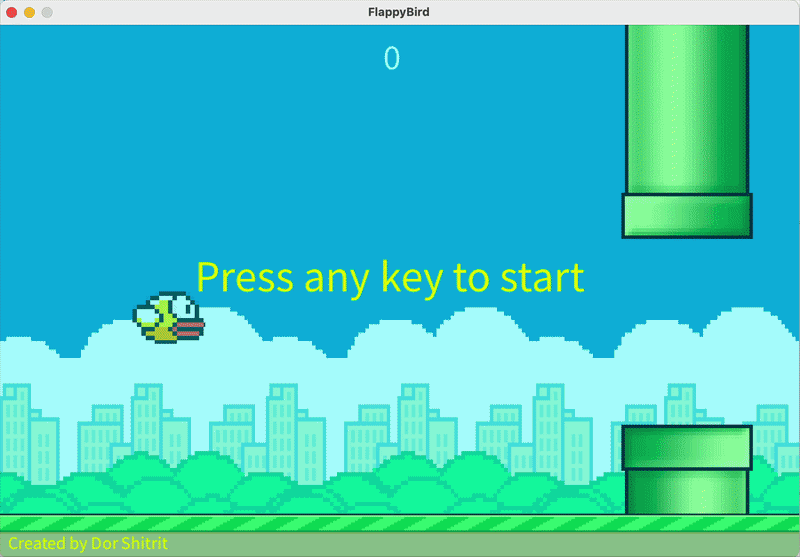

# 🐦 Flappy Bird

<p align="center">
  A classic <b>arcade flying game</b> inspired by <b>Flappy Bird</b>, where the player controls a bird and tries to fly through pipes while avoiding collisions and achieving the highest score.
</p>

---

## 🎮 Game Preview
 
<p align="center">

</p>

## 🕹 About the Game

**Flappy Bird** is a single-player arcade game built in **Processing**.

The player controls a bird that constantly falls due to gravity and must fly through gaps between pipes.

Pipes move from right to left across the screen, and the player must carefully time jumps to avoid hitting them.

### 🎯 Objective

- Fly through as many pipes as possible
- Avoid hitting pipes or the ground
- Achieve the highest score before crashing

---

## 📜 Gameplay Rules

- The bird is affected by **gravity**
- Pressing jump gives the bird an **upward impulse**
- Each pipe passed increases the **score by 1**
- The game ends if the bird:
  - Hits a pipe
  - Hits the ground
  - Flies out of the top boundary
- After reaching **5 points**, a second pipe lane appears
- After reaching **10 points**, the game speed increases

---

## 🎹 Controls

| Key / Input | Action |
|---|---|
| Space / Left Mouse Click | Jump |
| P | Pause / Resume |
| Any Key | Start the game |

---

## ✨ Features

- Classic Flappy Bird gameplay
- Gravity-based physics
- Random pipe generation
- Progressive difficulty
- Pause system
- Score tracking
- Sound effects and background music
- Game over screen with final score

---

## 🛠 Built With

- **Processing**
- **Java-based game logic**
- Custom sprites and textures
- Sound effects and music

---

## 🚀 How to Run

1. Install **Processing**
2. Clone this repository:
   ```bash
   git clone https://github.com/YOUR_USERNAME/Flappy-Bird.git
3. Open `FlappyBird.pde` in the **Processing IDE**
4. Make sure all image and audio files are inside the `data` folder
5. Click **Run**

---

## 👨🏽‍💻 Author

Created by **Dor Shitrit**
